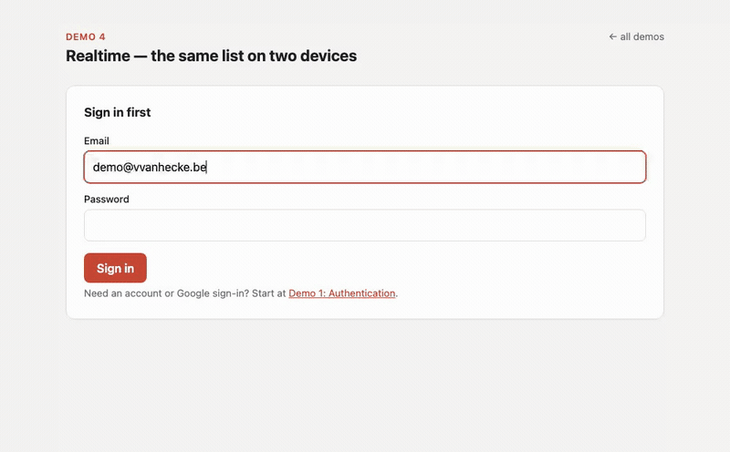

# Fusabase Demo — Oracle Backend with Firebase APIs

Four small browser demos that together form a **todo application** backed by an
Oracle Database, using the
[Oracle Backend with Firebase APIs](https://docs.oracle.com/en/database/oracle/backend-for-firebase/)
(the ORDS *FUSABASE* feature) and its
[JavaScript SDK](https://www.npmjs.com/package/fusabase).

Companion code for the blog series
[Oracle Backend with Firebase APIs](https://blog.vvanhecke.be/en/blog/oracle-backend-firebase-apis-setup/),
in particular **Part 2: Hands-On with Auth, Database and Storage**.

| Demo | What it shows |
| --- | --- |
| [`demos/01-auth`](demos/01-auth) | Email/password sign-up and sign-in, Google federated login, auth state, ID token claims |
| [`demos/02-database`](demos/02-database) | A per-user todo list on Firestore-style collections: `addDoc`, `getDocs`, `updateDoc`, `deleteDoc`, queries with `where` + `orderBy` |
| [`demos/03-storage`](demos/03-storage) | Per-user file attachments: resumable uploads with progress, `listAll`, download URLs, delete |
| [`demos/04-realtime`](demos/04-realtime) | Two live `onSnapshot` listeners on the same collection — the same todo list, synced across two "devices" |

Sign in once in demo 1 — the session persists in the browser and carries over
to the other demos.



## Running it

```bash
npm install
npm run dev
```

Then open http://localhost:5173/ and pick a demo.

`index.js` is the minimal Node smoke test from Part 1 of the series
(`node index.js`).

## Backend configuration this expects

The demos talk to the project configured in [`fusabase-config.js`](fusabase-config.js).
To point them at your own Fusabase project:

1. **App registration** — register a `WEB` app in the Console and paste the
   generated config object into `fusabase-config.js`.
2. **Authorized domain** — add your dev origin (e.g. `http://localhost:5173`)
   to the project's authorized domains (Project Settings › Authorized Domains),
   or browser auth calls fail CORS with `ORDS-13002`.
3. **Authentication** — BASIC auth enabled; optionally the Google provider for
   federated login.
4. **Database rules** — publish [`rules/database.rules`](rules/database.rules)
   for the `todos` collection. Without them every write is denied
   (`ORA-20015: Security rule not found, access denied`).
5. **Indexes** — the todo query combines `where('uid','==',…)` with
   `orderBy('createdAt','desc')`. Enable automatic indexes (or add a manual
   index) in the Console; complex queries require one outright.
6. **Storage rules** — publish [`rules/storage.rules`](rules/storage.rules)
   for the `attachments/{userId}` layout. Without them every upload is denied.

Everything in `fusabase-config.js` is client-side configuration, like a
Firebase config object — access control comes from auth and security rules,
not from hiding those ids.

## Realtime notes

`onSnapshot` (demo 4) has two transports:

- **Long polling** (default) — polls every **29 s** unless you lower it with
  `long_polling_interval` (5 s minimum). Demo 4 uses 5 s. Works over plain HTTP.
- **WebSocket** (`use_socket: true`) — instant, but connects to
  `wss://<host>/ords/baas-realtime/…`, so your reverse proxy must pass WebSocket
  upgrades on that path.

## Regenerating the blog screenshots

[`scripts/screenshots.mjs`](scripts/screenshots.mjs) drives the running app with
Playwright:

```bash
npm run dev            # in one terminal
npm i -D playwright && npx playwright install chromium
BASE_URL=http://localhost:5173 OUT_DIR=./shots \
  DEMO_EMAIL=you@example.com DEMO_PASSWORD=... node scripts/screenshots.mjs
```
